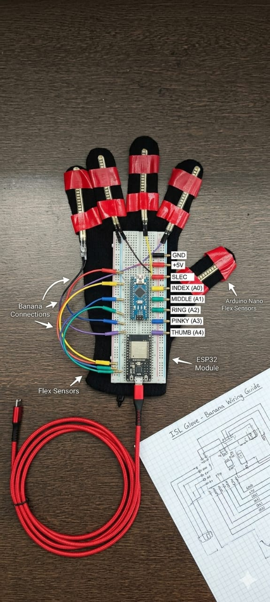

# ISL Pro | Humane Sign Language Dashboard

[](https://opensource.org/licenses/MIT)
[](https://www.espressif.com/en/products/socs/esp32)
[](https://developer.mozilla.org/en-US/docs/Web/API/Web_Bluetooth_API)

A high-fidelity, real-time Indian Sign Language (ISL) interpretation system. This project integrates a smart wearable (ESP32-based flex sensor glove) with a modern web dashboard via the Web Bluetooth API (BLE) to provide instant translation and voice synthesis.

---

## 📸 Hardware Architecture



### System Components:
- **Microcontroller**: ESP32-WROOM-32 (Dual-core, Integrated BLE/Wi-Fi).
- **Sensors**: 5x High-precision Flex Sensors (mapping Thumb, Index, Middle, Ring, and Pinky).
- **Circuitry**: Voltage divider network for analog signal processing.
- **Power**: 5V USB / 3.7V Li-Po compatible.

---

## 🛠️ Technical Specifications

### Hardware Mapping (ESP32 ADC Pins):
| Finger | GPIO Pin | Threshold |
|--------|----------|-----------|
| Thumb  | GPIO 34  | 100       |
| Index  | GPIO 35  | 350       |
| Middle | GPIO 32  | 150       |
| Ring   | GPIO 33  | 20        |
| Pinky  | GPIO 25  | 20        |

### BLE Protocol:
- **Device Name**: `ISL_Glove_Pro`
- **Service UUID**: `4fafc201-1fb5-459e-8fcc-c5c9c331914b`
- **Characteristic UUID**: `beb5483e-36e1-4688-b7f5-ea07361b26a8`
- **Data Transmission**: JSON-encoded notification packets sent every 400ms.

### Software Stack:
- **Frontend**: Vanilla HTML5, CSS3 (Modern Flexbox/Grid), JavaScript (ES6+).
- **Communication**: Web Bluetooth API for low-latency peripheral interaction.
- **Visuals**: Lucide Icons, Google Fonts (Outfit).
- **Firmware**: Arduino/C++ utilizing the `ESP32 BLE Arduino` library.

---

## ✨ Features

- **Real-time Interpretation**: Asynchronous processing of sensor data into meaningful ISL vocabulary.
- **Visual Coaching (Academy Mode)**: Interactive 3D-simulated hand visualizer for guided learning.
- **Voice Synthesis**: Integrated Web Speech API for real-time text-to-speech (TTS) output.
- **Adaptive UI**: Dynamic Light/Dark mode transitions with a custom hardware-inspired slider.
- **PWA Ready**: Offline-capable via Service Worker integration (`sw.js`).

---

## 🚀 Installation & Deployment

### 1. Firmware Upload
1. Open `glove_esp32.ino` in the Arduino IDE.
2. Install the ESP32 board support and `BLE` libraries.
3. Upload the code to your ESP32 module.

### 2. Dashboard Setup
1. Clone the repository:
   ```bash
   git clone https://github.com/TharunRevinth/isl_glove.git
   ```
2. Serve the directory using any static web server (e.g., `npx serve .` or Live Server).
3. Access the dashboard via a BLE-compatible browser (Chrome/Edge recommended).

### 3. Usage
1. Click **CONNECT BLE** on the dashboard.
2. Select `ISL_Glove_Pro` from the device list.
3. Perform gestures to see real-time translation and hear audio feedback.

---

## 📁 Project Structure

```text
├── index.html       # Application Entry Point
├── app.js           # Core BLE & UI Logic
├── style.css        # Premium Design System
├── glove_esp32.ino  # ESP32 Firmware Source
├── sw.js            # Service Worker for PWA support
└── hardware_setup.png # System Wiring Diagram
```

---
*Developed for inclusive communication and assistive technology hackathons.*
